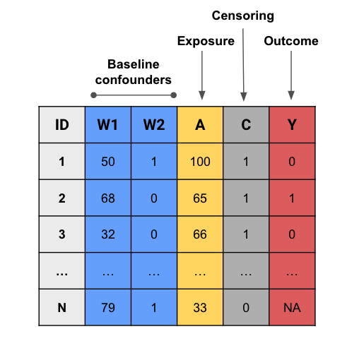
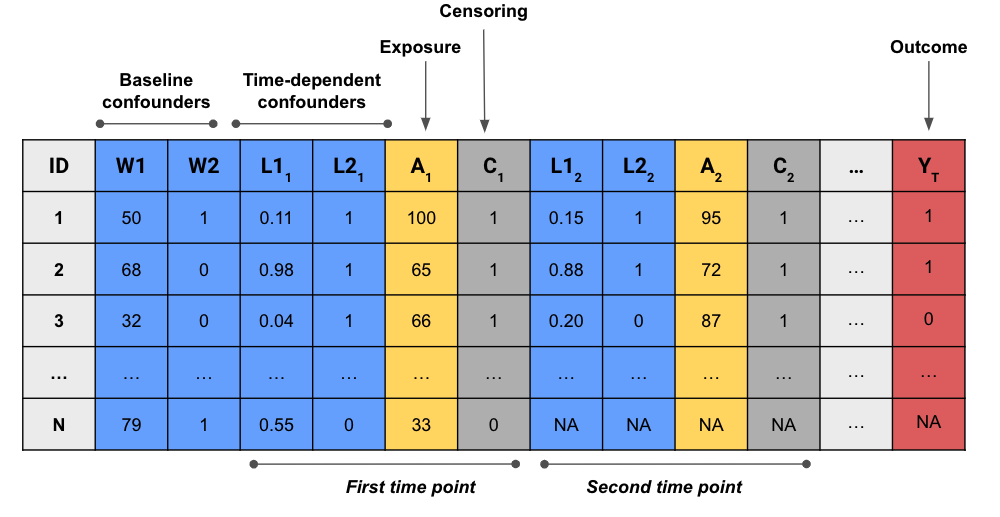
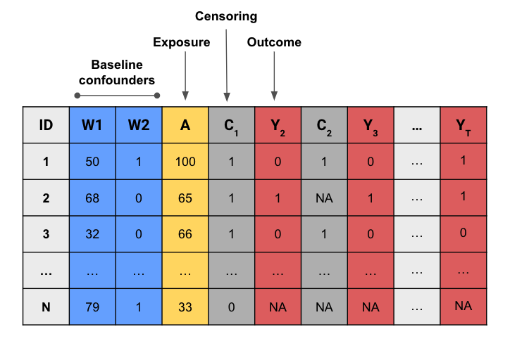

<!-- README.md is generated from README.Rmd. Please edit that file -->

# lmtp </a>

<!-- badges: start -->

[](https://CRAN.R-project.org/package=lmtp)
 [](https://github.com/nt-williams/lmtp/actions)
[](https://app.codecov.io/gh/nt-williams/lmtp)
[](https://www.gnu.org/licenses/gpl-3.0)
[](https://www.repostatus.org/#active)
<!-- badges: end -->

> Non-parametric Causal Effects of Feasible Interventions Based on
> Modified Treatment Policies

Nick Williams and Ivan Diaz

------------------------------------------------------------------------

**lmtp** is an R package that provides an estimation framework for the
casual effects of feasible interventions based on point-treatment and
longitudinal modified treatment policies as described in Diaz, Williams,
Hoffman, and Schenck (2020). Two primary estimators are supported, a
targeted maximum likelihood (TML) estimator and a sequentially doubly
robust (SDR) estimator (a G-computation and an inverse probability of
treatment weighting estimator are provided for the sake of being
thorough but their use is recommended against in favor of the TML and
SDR estimators). Both binary and continuous outcomes (both with
censoring) are allowed. **lmtp** is built atop the
[`SuperLearner`](https://CRAN.R-project.org/package=SuperLearner)
package to utilize ensemble machine learning for estimation. The
treatment mechanism is estimated via a density ratio classification
procedure irrespective of treatment variable type providing decreased
computation time when treatment is continuous. Dynamic treatment regimes
are also supported.

A list of papers using **lmtp** is
[here](https://gist.github.com/nt-williams/15068f5849a67ff4d2cb7f2dcf97b3de).

For an in-depth look at the package’s functionality, please consult the
accompanying vignette.

## Installation

**lmtp** can be installed from CRAN with:

``` r
install.packages("lmtp")
```

The stable, development version can be installed from GitHub with:

``` r
devtools::install_github("nt-williams/lmtp@devel")
```

The **sl3** compatible version can be installed from GitHub with:

``` r
devtools::install_github("nt-williams/lmtp@sl3")
```

A version allowing for different covariates sets for the treatment and
outcome regressions:

``` r
devtools::install_github("nt-williams/lmtp@2covarSets")
```

A version allowing for different covariates sets for the treatment and
outcome regressions and that uses **sl3**:

``` r
devtools::install_github("nt-williams/lmtp@2covarSets-sl3")
```

## What even is a modified treatment policy?

Modified treatment policies (MTP) are interventions that can depend on
the *natural* value of the treatment (the treatment value in the absence
of intervention). A key assumption for causal inference is the
*positivity assumption* which states that all observations have a
non-zero probability of experiencing a treatment value. **When working
with continuous or multivalued treatments, violations of the positivity
assumption are likely to occur. MTPs offer a solution to this problem.**

## Can lmtp estimate other effects?

Yes! **lmtp** can estimate the effects of deterministic, static
treatment effects (such as the ATE) and deterministic, dynamic treatment
regimes for binary, continuous, and survival outcomes.

### Features

| Feature                         | Status |
|---------------------------------|:------:|
| Point treatment                 |   ✓    |
| Longitudinal treatment          |   ✓    |
| Modified treatment intervention |   ✓    |
| Static intervention             |   ✓    |
| Dynamic intervention            |   ✓    |
| Continuous treatment            |   ✓    |
| Binary treatment                |   ✓    |
| Categorical treatment           |   ✓    |
| Missingness in treatment        |        |
| Continuous outcome              |   ✓    |
| Binary outcome                  |   ✓    |
| Censored outcome                |   ✓    |
| Mediation                       |        |
| Survey weights                  |   ✓    |
| Super learner                   |   ✓    |
| Clustered data                  |   ✓    |
| Parallel processing             |   ✓    |
| Progress bars                   |   ✓    |

## Example

``` r
library(lmtp)

# the data: 4 treatment nodes with time varying covariates and a binary outcome
head(sim_t4)
#>   ID L_1 A_1 L_2 A_2 L_3 A_3 L_4 A_4 Y
#> 1  1   2   3   0   1   1   1   1   3 0
#> 2  2   2   1   1   4   0   3   1   2 0
#> 3  3   1   0   1   3   1   2   1   1 1
#> 4  4   1   0   0   3   1   3   1   2 0
#> 5  5   3   3   1   1   0   1   1   2 0
#> 6  6   1   0   0   2   0   3   1   4 0
```

We’re interested in a treatment policy, `d`, where exposure is decreased
by 1 only among subjects whose exposure won’t go below 1 if intervened
upon. The true population outcome under this policy is about 0.305.

``` r
# a treatment policy function to be applied at all time points
policy <- function(data, trt) {
  (data[[trt]] - 1) * (data[[trt]] - 1 >= 1) + data[[trt]] * (data[[trt]] - 1 < 1)
}
```

In addition to specifying a treatment policy, we need to specify our
treatment variables and time-varying covariates.

``` r
# treatment nodes, a character vector of length 4
A <- c("A_1", "A_2", "A_3", "A_4")
# time varying nodes, a list of length 4
L <- list(c("L_1"), c("L_2"), c("L_3"), c("L_4"))
```

We can now estimate the effect of our treatment policy, `d`. In this
example, we’ll use the cross-validated TML estimator with 10 folds.

``` r
lmtp_tmle(sim_t4, A, "Y", time_vary = L, shift = policy, intervention_type = "mtp", folds = 10)
#> LMTP Estimator: TMLE
#>    Trt. Policy: (policy)
#> 
#> Population intervention effect
#>       Estimate: 0.2526
#>     Std. error: 0.0105
#>         95% CI: (0.2321, 0.2732)
```

## Data structure

#### Single time point



#### Time-varying exposure and confounders, not survival outcome



#### Single exposure, survival outcome



#### Time-varying exposure and confounders, survival outcome


## Similar Implementations

A variety of other R packages perform similar tasks as **lmtp**.
However, **lmtp** is the only R package currently capable of estimating
causal effects for binary, categorical, and continuous exposures in both
the point treatment and longitudinal setting using traditional causal
effects or modified treatment policies.

-   [`txshift`](https://github.com/nhejazi/txshift)  
-   [`tmle3`](https://github.com/tlverse/tmle3)  
-   [`tmle3shift`](https://github.com/tlverse/tmle3shift)
-   [`ltmle`](https://CRAN.R-project.org/package=ltmle)  
-   [`tmle`](https://CRAN.R-project.org/package=tmle)

## Citation

Please cite the following when using **lmtp** in publications. Citation
should include both the R package and the paper establishing the
statistical methodology.

    @Manual{,
      title = {lmtp: {Non}-parametric {Causal} {Effects} of {Feasible} {Interventions} {Based} on {Modified} {Treatment} {Policies}},
      author = {Nicholas T Williams and Iván Díaz},
      year = {2021},
      note = {R package version 1.3.1},
      doi = {10.5281/zenodo.3874931}, 
      url = {https://github.com/nt-williams/lmtp}
    }

    @article{
      doi:10.1080/01621459.2021.1955691,
      author = {Iván Díaz and Nicholas Williams and Katherine L. Hoffman and Edward J. Schenck},
      title = {Non-parametric causal effects based on longitudinal modified treatment policies},
      journal = {Journal of the American Statistical Association},
      year  = {2021},
      doi = {10.1080/01621459.2021.1955691},
      URL = {https://doi.org/10.1080/01621459.2021.1955691},
    }

## References

Iván Díaz, Nicholas Williams, Katherine L. Hoffman & Edward J. Schenck
(2021) Non-parametric causal effects based on longitudinal modified
treatment policies, Journal of the American Statistical Association,
DOI: 10.1080/01621459.2021.1955691
