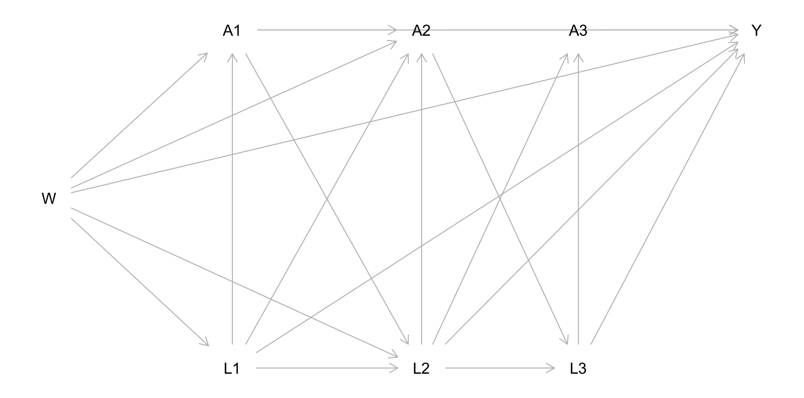
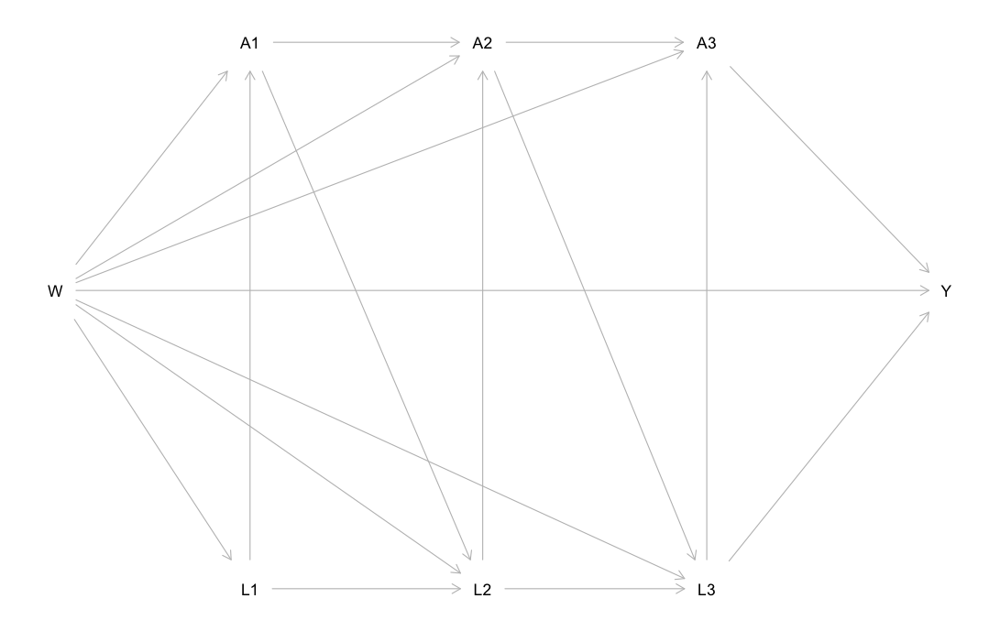

```{r, include = FALSE}
knitr::opts_chunk$set(
  collapse = TRUE,
  comment = "#>"
)
```

<style type="text/css">
.table {

    width: 50%;
    margin: 0 auto;  

}
</style>

__Authors__: [Nick Williams](https://nicholastwilliams.com) and [Ivan Diaz](https://idiaz.xyz)  
__Updated__: `r Sys.Date()` 

This document serves as an introductory guide to using the `lmtp` package. `lmtp` provides an estimation framework for the casual effects of longitudinal modified treatment policies using ensemble machine learning as described in Diaz, Williams, and Hoffman (2020). While originally developed to estimate the effect of continuous exposures, `lmtp` naturally extends to allowing the estimation of traditional causal effects based on binary and categorical exposures in both point treatment and time-varying situations. 

While not possible to cover everything, this introductory guide should equip users of `lmtp` with enough knowledge to handle the majority of use cases. In addition, we assume the analyst has basic knowledge of non-parametric estimation for causal inference; the specifics of the methodology behind the provided functions is not discussed. 

```{r}
library(lmtp)
```

## Functions & parameters

> The goal of this section is to introduce the main `lmtp` functions and develop a basic understanding of required and useful function parameters.

### The estimators

`lmtp` supplies 2 main estimators: 

- a targeted maximum likelihood (TML) estimator: `lmtp_tmle()`
- a sequentially doubly robust (SDR) estimator: `lmtp_sdr()`

Two auxiliary estimators are also provided, however, the use of these estimators is recommended against in favor of the TML or SDR estimators: 

- a G-computation (substitution) estimator: `lmtp_sub()`
- an inverse probability of treatment weighting (IPW) estimator: `lmtp_ipw()`

### Parameter overview

The following table describes `lmtp` parameters across the provided estimators: 

| Parameter        |   TMLE  |   SDR   | Substitution |   IPW   |
|------------------|:-------:|:-------:|:------------:|:-------:|
| data             | &check; | &check; |    &check;   | &check; |
| trt              | &check; | &check; |    &check;   | &check; |
| outcome          | &check; | &check; |    &check;   | &check; |
| nodes            | &check; | &check; |    &check;   | &check; |
| baseline         | &check; | &check; |    &check;   | &check; |
| cens             | &check; | &check; |    &check;   | &check; |
| k                | &check; | &check; |    &check;   | &check; |
| shift            | &check; | &check; |    &check;   | &check; |
| outcome_type     | &check; | &check; |    &check;   |         |
| bounds           | &check; | &check; |    &check;   |         |
| learners         |         |         |    &check;   | &check; |
| learners_outcome | &check; | &check; |              |         |
| learners_trt     | &check; | &check; |              |         |
| folds            | &check; | &check; |    &check;   | &check; |

<br>

While many parameters aren't required, the default options will likely give sub par (or incorrect) results. Special attention should be given to the `k` parameter which is fully described in the [Node lists & Markov processes] section.

### sl3

`lmtp` relies on the `sl3` package to use ensemble machine learning during estimation procedures. To fully take advantage of the provided estimators, users must create `sl3` learner stacks. Learner stacks are passed to `lmtp` estimators either through the `learners` argument for `lmtp_sub()` and `lmtp_ipw()` or the `learners_trt` and `learners_outcome` arguments for `lmtp_tmle()` and `lmtp_sdr()`. A full list of supplied `sl3` learners can be found [here](https://tlverse.org/sl3/reference/index.html). 

The easiest way to create an `sl3` learner stack is using `sl3::make_learner_stack()`. 

```{r}
library(sl3)

# using learner defaults
lrnrs <- make_learner_stack(Lrnr_mean, 
                            Lrnr_glm, 
                            Lrnr_ranger)

# specifying learner parameters
lrnrs <- 
  make_learner_stack(
    Lrnr_mean, 
    Lrnr_glm,
    list(Lrnr_ranger, 
         num.trees = 1000)
  )
```

The outcome type should guide users on selecting the appropriate learners for a stack when specifying `learners` with `lmtp_sub()` or `learners_outcome` with `lmtp_tmle()` and `lmtp_sdr()`. Regardless of whether an exposure/treatment is continuous, binary, or categorical, the exposure mechanism is estimated through classification, thus the analyst should only use `sl3` learners that can handle a binary outcome when specifying `learners` with `lmtp_ipw()` or `learners_trt` with `lmtp_tmle()` or `lmtp_sdr()`. 

The ensemble meta-learner is always set to `Lrnr_nnls`. If learner stacks aren't provided, `lmtp` estimators default to an ensemble only made of `Lrnr_mean` and `Lrnr_glm`. 

> *`lmtp` is a peacock, if you want to let it fly, you should use a more comprehensive learner than supplied by the defaults.*

**It is recommended the analyst reads through the `sl3` [documentation](https://tlverse.org/sl3/index.html) to fully utilize `lmtp`.**

### Node lists & Markov processes

> *when in doubt, use `k = Inf`*

Estimating causal effects in longitudinal settings requires paying special attention to the time-ordering and relationships among covariates. In the `lmtp` framework, there are 5 types of variables: treatment, outcome, baseline, time-varying, and censoring. Treatment and outcome variables are self-explanatory, baseline variables are those that are observed pre-treatment allocation, don't change (i.e., age at treatment assignment), and always are used for estimation at all time points, time-varying variables  are variables that (you guessed it...) change over time, censoring nodes indicate if an observation is observed (or censored) at the next time-point.

How these nodes are specified depends on the specific data generating mechanism and should be pre-specified based on a conceptual model (i.e, a DAG). How these nodes are used by `lmtp` estimators is specified by what we call a node list. The analyst doesn't explicitly create the node list themself, but instead supplies the variables and the instructions on how to combine; this is done through the `k` parameter. 

Creating a node list is best understood through demonstration. The following DAG specifies 1 baseline node, `W`, 3 treatment nodes, `A1`, `A2`, `A3`, 3 time-varying nodes, `L1`, `L2`, `L3`, and an outcome, `Y`. 

```{r out.width="80%", echo=FALSE}

```

According to the DAG, `Y` is directly affected by all nodes in the model, `k = Inf` would be the correct instructions for creating this node list. 

```{r}
a <- c("A1", "A2", "A3")
baseline <- c("W")
nodes <- list(c("L1"), 
              c("L2"), 
              c("L3"))

# we can make sure our specification is correct by checking create_node_list()
create_node_list(a, nodes, baseline = baseline, k = Inf)
```

Notice that the time-varying covariates are specified using a list of vectors, allowing the analyst to specify multiple time-varying covariates at each time-point of observation. The length of this list should be the same length as the treatment vector, `a` in this example (the one exception to this rule is in [Survival analysis]). 

What if we modify the DAG so that `Y` is only directly affected by `A3`, `L3`, and `W`? We could say this data generating mechanism is now a Markov process (*kind of*, hence `k`) and the correct `k` would be `k = 1`. 

```{r out.width="80%", echo=FALSE}

```

```{r}
a <- c("A1", "A2", "A3")
baseline <- c("W")
nodes <- list(c("L1"), 
              c("L2"), 
              c("L3"))

# again checking or specification
create_node_list(a, nodes, baseline = baseline, k = 1)
```

Censoring nodes are discussed in the [Censored outcomes] section.

## Calculating effects

> The goal of this section is to identify how to estimate different causal effects using `lmtp` estimators.

### Traditional causal effects

For the purposes of this guide, a traditional causal effect is the causal effect of any intervention, $\delta$, that is applied to all observations at all time points. 

$$d_t(a_t, h_t) = a_t - \delta_t$$

### Modified treatment policies

The causal effect of a modified treatment policy is the effect of an intervention that is only applied to observations where the intervention is feasible. What's feasible in this case is defined by $a_t>u_t(h_t) + \delta_t$, where $u_t$ is an analyst-specified value. Interested readers are referred to Diaz, Williams, and Hoffman (2020) for an overview of modified treatment policies and their benefits compared to those of traditional causal effects. 

$$
d_t(a_t, h_t)=\left\{ \begin{array}{l}
    a_t - \delta_t & \text{if $a_t>u_t(h_t) + \delta_t$}\\
    a_t & \text{if $a_t \leq u_t(h_t) + \delta_t$}\\
  \end{array} \right.
$$

### Shift functions

To estimate the effect of a traditional causal intervention or a modified treatment policy in `lmtp` we need to translate these interventions into a shift function. Shift functions are applied to treatment nodes at each time point. A shift function for a traditional intervention where the exposure decreases by 1 unit for all observations at every time point would look like: 

```{r}
shift <- function(trt) {
  trt - 1
}
```

In contrast, we may interested in the effect of a modified treatment policy where exposure is decreased by 1 unit only among subjects whose exposure won’t go below 1 if intervened upon:

```{r}
shift <- function(trt) {
  (trt - 1) * (trt - 1 >= 1) + trt * (trt - 1 < 1)
}
```

Shift functions are passed to lmtp estimators through the `shift` argument. Currently, shift functions can only depend on the value of the current treatment node. However, the ability to evaluate dynamic treatment regimes will be established in a future version.

```{r, eval = F}
# using the previous shift function with sdr
a <- c("A_1", "A_2", "A_3", "A_4")
time_varying <- list(c("L_1"), c("L_2"), c("L_3"), c("L_4"))
lrnrs <- make_learner_stack(Lrnr_mean, Lrnr_glm)

lmtp_sdr(sim_t4, a, "Y", time_varying, k = 1, shift = shift, 
         learners_outcome = lrnrs, learners_trt = lrnrs, folds = 5)
#> LMTP Estimator: SDR
#>    Trt. Policy: (shift)
#> 
#> Population intervention effect
#>       Estimate: 0.2563
#>     Std. error: 0.0165
#>         95% CI: (0.2241, 0.2886)
```

#### Binary treatment

In the case of a binary treatment/exposure the shift function would simply set treatment/exposure to either 0 or 1 depending on the effect of interest:

```{r, eval = F}
# set exposure to 1 for all observations at all time points
shift <- function(x) 1

# set exposure to 0 for all observations at all time points
shift_0 <- function(x) 0

# a binary trt example
data("iptwExWide", package = "twang")

a <- paste0("tx", 1:3)
nodes <- list(c("gender", "age", "use0"),
              c("use1"), 
              c("use2"))
lrnrs <- make_learner_stack(Lrnr_mean, Lrnr_glm)

lmtp_tmle(iptwExWide, a, "outcome", nodes, shift = shift, 
          outcome_type = "continuous",
          learners_outcome = lrnrs, learners_trt = lrnrs, folds = 5)
#> LMTP Estimator: TMLE
#>    Trt. Policy: (shift)
#> 
#> Population intervention effect
#>       Estimate: -0.287
#>     Std. error: 0.07
#>         95% CI: (-0.4242, -0.1497)
```

### Categorical treatment

To evaluate the effect of an intervention on a categorical exposure, the shift function needs to respect the potential levels of the variable, even when those levels may not be observed. Categorical treatment nodes should be coded as factors and dummy variables should not be created.

```{r, eval = F}
a <- c("A_1", "A_2", "A_3", "A_4")
time_varying <- list(c("L_1"), c("L_2"), c("L_3"), c("L_4"))
lrnrs <- make_learner_stack(Lrnr_mean, Lrnr_glm)

# converting the observed exposures to an ordered factor
for (i in a) {
  sim_t4[[i]] <- factor(sim_t4[[i]], levels = 0:5, ordered = T)
}

# a shift function that respects that exposure is an ordered factor
shift <- function(a) {
    out <- list()
    for (i in 1:length(a)) {
      if (as.character(a[i]) %in% c("0", "1")) {
        out[[i]] <- as.character(a[i])
      } else {
        out[[i]] <- as.numeric(as.character(a[i])) - 1
      }
    }
    factor(unlist(out), levels = 0:5, ordered = T)
}

lmtp_sdr(sim_t4, a, "Y", time_varying, k = 1, shift = shift, folds = 2)
#> LMTP Estimator: SDR
#>    Trt. Policy: (shift)
#> 
#> Population intervention effect
#>       Estimate: 0.2895
#>     Std. error: 0.0179
#>         95% CI: (0.2543, 0.3246)
```

### Censored outcomes

In the (likely) case of missing outcomes, `lmtp` can estimate the effect of a hypothetical treatment regime where all observations remained uncensored at end of follow-up. To do this, the user must supply a vector containing the names of censoring indicators for each treatment time point to `lmtp` estimators through the `cens` argument. Censoring nodes should be defined such that at any time, $t$, if an observation is observed at time $t + 1$ they receive a 1 and a 0 otherwise.

**Note: Censoring nodes must be provided if there are missing outcomes.**

```{r}
# all observations that were observed through time 1
head(sim_cens[sim_cens$C1 == 1, ])

# all observations censored after time 1
head(sim_cens[sim_cens$C1 == 0, ])

# all observations censored after time 2
head(sim_cens[sim_cens$C2 == 0, ])
```

```{r, eval = F}
# estimating an effect when there is censoring
a <- c("A1", "A2")
nodes <- list(c("L1"), c("L2"))
cens <- c("C1", "C2")
lrnrs <- make_learner(Lrnr_glm)

lmtp_tmle(sim_cens, a, "Y", nodes, cens = cens, k = 1, 
          shift = function(x) x + 0.5, learners_outcome = lrnrs,
          learners_trt = lrnrs)
#> LMTP Estimator: TMLE
#>    Trt. Policy: (function(x) x + 0.5)
#> 
#> Population intervention effect
#>       Estimate: 0.8869
#>     Std. error: 0.0149
#>         95% CI: (0.8577, 0.916)
```

### Survival analysis

Time-to-event analyses are supported for both time-invariant and time-varying exposures. The `outcome` argument should be provided a vector containing the names of intermediate outcome variables as well as the final outcome variable. This means that if the `nodes` argument is supplied a list of length $\tau$ then the length of the vector supplied to the `outcome` argument should be of length $\tau + 1$. 

For time-to-event problems, the intermediate outcome variables serve as indicators for when an observation experiences the event before the end of follow-up. If an observation does experience the event before the final outcome time, all future outcome variables (including the final outcome) variable should be set to 1. The function `event_locf()` (last observation carried forward, only for events) is provided to help with this imputation. 

The following example shows how to estimate the cumulative incidence of an event at time $\tau + 1 = 7$ under a hypothetical intervention where all subjects point treatment is set to 1. Notice that even though there are no time-varying covariates in the data, we still supply a list of length $\tau = 6$ to the `nodes` argument with all the items set to `NULL`.  

```{r, eval = F}
head(sim_point_surv)
#>   W1 W2 trt Y.0 C.0 Y.1 C.1 Y.2 C.2 Y.3 C.3 Y.4 C.4 Y.5 C.5 Y.6
#> 1  0  0   0   0   1   0   1   0   1   0   0  NA   0  NA   0  NA
#> 2  0  1   1   0   1   0   1   0   1   0   0  NA   0  NA   0  NA
#> 3  1  1   1   0   1   0   1   0   1   0   1   0   1   0   0  NA
#> 4  1  1   1   0   1   0   1   0   1   0   1   1   0   1   0   1
#> 5  0  1   1   0   1   0   1   0   1   0   1   0   0  NA   0  NA
#> 6  1  2   1   0   1   0   1   0   1   0   1   0   1   0   1   1

a <- "trt"
y <- paste0("Y.", 0:6)
cens <- paste0("C.", 0:5)
baseline <- c("W1", "W2")
nodes <- lapply(0:5, function(x) NULL)
lmtp_tmle(sim_point_surv, a, y, nodes, baseline, cens, shift = function(x) 1, folds = 2)
#> LMTP Estimator: TMLE
#>    Trt. Policy: (function(x) 1)
#> 
#> Population intervention effect
#>       Estimate: 0.8111
#>     Std. error: 0.0185
#>         95% CI: (0.7748, 0.8475)
```

#### Population mean outcome

In certain situations, the user may be interested in the population mean outcome under no intervention. In the presence of censoring, this can be estimated by setting `shift = NULL` and providing censoring indicators. 

```{r, eval = F}
a <- c("A1", "A2")
nodes <- list(c("L1"), c("L2"))
cens <- c("C1", "C2")
lrnrs <- make_learner(Lrnr_glm)

lmtp_tmle(sim_cens, a, "Y", nodes, cens = cens, k = 1, 
          shift = NULL, learners_outcome = lrnrs,
          learners_trt = lrnrs)
#> LMTP Estimator: TMLE
#>    Trt. Policy: (NULL)
#> 
#> Population intervention effect
#>       Estimate: 0.7978
#>     Std. error: 0.0142
#>         95% CI: (0.7701, 0.8256)
```

### Calculating contrasts

The effects returned by `lmtp` estimators are population intervention effects, that is the expected mean outcome in the population under the hypothetical intervention. Often, however, we are also interested in the comparison of different interventions to each other or to no intervention at all. This is the role of `lmtp_contrast()`. 

```{r, eval = F}
a <- c("A1", "A2")
nodes <- list(c("L1"), c("L2"))
cens <- c("C1", "C2")
lrnrs <- make_learner(Lrnr_glm)

fit_shift <- 
  lmtp_tmle(sim_cens, a, "Y", nodes, cens = cens, k = 1, 
            shift = function(x) x + 0.5, learners_outcome = lrnrs,
            learners_trt = lrnrs, folds = 2)

fit_noshift <- 
  lmtp_tmle(sim_cens, a, "Y", nodes, cens = cens, k = 1, 
            shift = NULL, learners_outcome = lrnrs,
            learners_trt = lrnrs, folds = 2)

lmtp_contrast(fit_shift, ref = fit_noshift, type = "additive")
#>   LMTP Contrast: additive
#> Null hypothesis: theta == 0
#> 
#>    theta shift   ref std.error conf.low conf.high p.value
#> 1 0.0995 0.897 0.797   0.00985   0.0802     0.119  <0.001

lmtp_contrast(fit_shift, ref = fit_noshift, type = "rr")
#>   LMTP Contrast: relative risk
#> Null hypothesis: theta == 1
#> 
#>   theta shift   ref std.error conf.low conf.high p.value
#> 1  1.12 0.897 0.797    0.0117      1.1      1.15  <0.001
```

Any number of `lmtp` fits can specified in `lmtp_contrast()` to be compared to either a single reference fit or a known scalar. 

```{r, eval = F}
lmtp_contrast(fit_shift, fit_noshift, ref = 0.787)
#> Non-estimated reference value, defaulting type = 'additive'.
#> 
#>   LMTP Contrast: additive
#> Null hypothesis: theta == 0
#> 
#>    theta shift   ref std.error conf.low conf.high p.value
#> 1 0.1099 0.897 0.787    0.0150   0.0805    0.1393  <0.001
#> 2 0.0104 0.797 0.787    0.0142  -0.0174    0.0382   0.464
```

### Bootstrap for G-comp & IPW

There is no theory to provide standard errors for the G-computation or IPW estimators when using data-adaptive estimation procedures such as the super learner; standard errors are thus not provided. However, if using a pre-specified parametric model for estimation, (i.e., only including `Lrnr_glm`), inference can be performed using the non-parametric bootstrap.

```{r bootstrap, eval = F}
resamples <- lapply(1:100, function(x) sim_t4[1:100, ][sample(1:100, replace = T), ])
a <- c("A_1", "A_2", "A_3", "A_4")
time_varying <- list(c("L_1"), c("L_2"), c("L_3"), c("L_4"))
d <- function(a) (a - 1) * (a - 1 >= 1) + a * (a - 1 < 1)
lrnrs <- make_learner(Lrnr_glm)

thetas <- lapply(1:100, function(x) {
  lmtp_ipw(resamples[[x]], a, "Y", time_varying, 
           k = 1, shift = d, learners = lrnrs, folds = 2)$theta
})

quantile(unlist(thetas), c(0.025, 0.975))
#>       2.5%      97.5% 
#> 0.08490264 0.46476965 
```

## Extra features

> The goal of this section is to identify extra features supported by `lmtp` that can improve the user experience. 

### Tidy results

`lmtp` automatically provides a `tidy` method as described in the [`broom`](https://cran.r-project.org/web/packages/broom/index.html) package: 

```{r tidy}
a <- c("A_1", "A_2", "A_3", "A_4")
time_varying <- list(c("L_1"), c("L_2"), c("L_3"), c("L_4"))
d <- function(a) (a - 1) * (a - 1 >= 1) + a * (a - 1 < 1)
lrnrs <- make_learner_stack(Lrnr_glm)

fit <- lmtp_tmle(sim_t4, a, "Y", time_varying, k = 1, shift = d, 
                 learners_outcome = lrnrs, learners_trt = lrnrs, folds = 2)

tidy(fit)
```

### Parallel processing with future

Computation time can quickly increase in situations with lots of time points, complex ensemble learners, and large datasets. In response, `lmtp` provides support for parallel processing using the [`future`](https://cran.r-project.org/web/packages/future/index.html) package. The simplest way to use `lmtp` estimators in parallel is to run `plan(multiprocess)`. 

```{r, eval = F}
library(future)

a <- c("A_1", "A_2", "A_3", "A_4")
time_varying <- list(c("L_1"), c("L_2"), c("L_3"), c("L_4"))
d <- function(a) (a - 1) * (a - 1 >= 1) + a * (a - 1 < 1)
lrnrs <- make_learner_stack(Lrnr_mean, 
                            Lrnr_glm, 
                            Lrnr_ranger)

system.time(
  lmtp_tmle(sim_t4, a, "Y", time_varying, k = 1, shift = d, 
            learners_outcome = lrnrs, learners_trt = lrnrs, folds = 10)
)
#>      user  system  elapsed 
#>  1371.914  34.843  634.613 

plan(multiprocess)

system.time(
  lmtp_tmle(sim_t4, a, "Y", time_varying, k = 1, shift = d, 
            learners_outcome = lrnrs, learners_trt = lrnrs, folds = 10)
)
#>   user  system elapsed 
#>  2.353   0.301 194.322 
```

We recommend consulting the `future` [documentation](https://cran.r-project.org/web/packages/future/future.pdf) for more information.

### Progress bars with progressr

In the presence of long computation time, a lack of user feedback can become very frustrating. To address this, `lmtp` supports the use of progress bars during computation through the [`progressr`](https://cran.r-project.org/web/packages/progressr/index.html) package.

```{r, eval = F}
library(progressr)

with_progress({
  fit <- lmtp_tmle(...)
})
```

We recommend consulting the `progressr` [documentation](https://cran.r-project.org/web/packages/progressr/progressr.pdf) for more information. 

## References

Ivan Diaz, Nicholas Williams, & Katherine Hoffman, 2020. Non-Parametric Causal Effects Based on Longitudinal Modified Policies.
